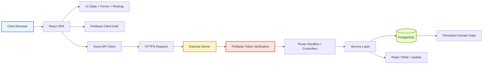
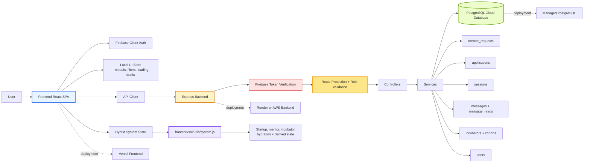
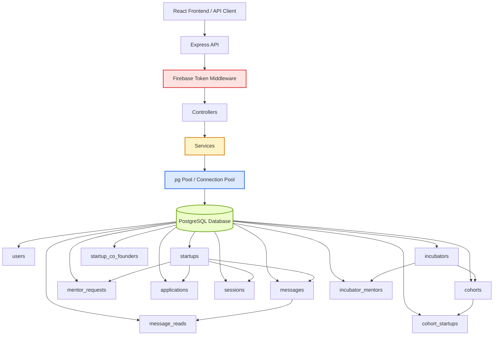
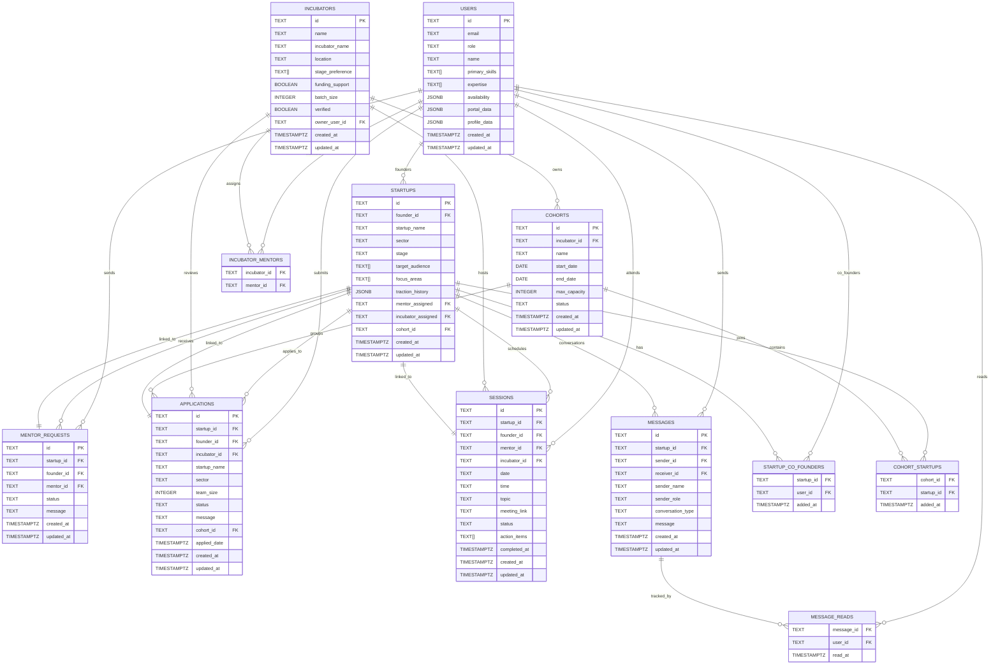
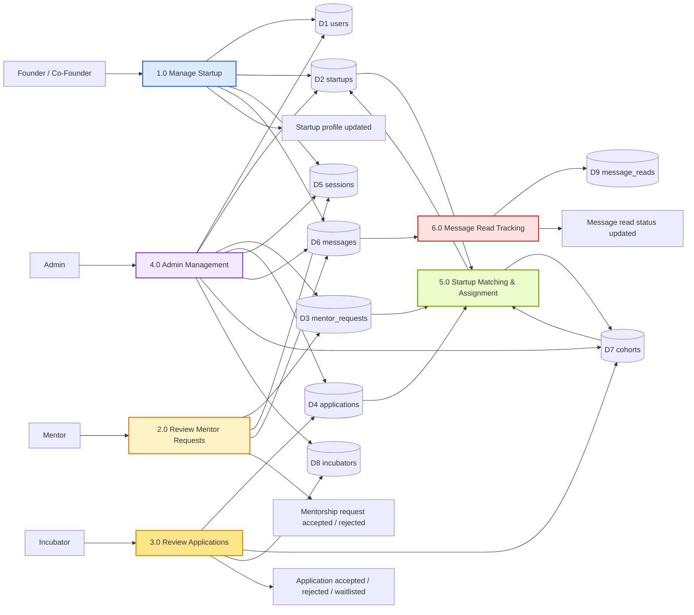

# YEN Platform Documentation

## Overview

YEN is a role-based startup collaboration and incubation platform. It connects founders, co-founders, mentors, incubators, and administrators in one system for startup discovery, team collaboration, mentorship, incubator applications, cohort management, sessions, and messaging.

The codebase is organized as a two-part monorepo:

- `frontend/` is a React single-page application built with Vite.
- `backend/` is an Express API connected to PostgreSQL and Firebase Admin authentication.

The project is currently implemented as a hybrid system:

- Authentication is handled through Firebase on the client side.
- Backend API requests are authenticated with Firebase ID tokens.
- Some frontend views are API-driven, while other parts still rely on local/system state utilities.

## Problem Statement

The platform solves a common startup-ecosystem problem: different participants use separate tools to manage startup profiles, mentorship, incubator applications, and team communication.

Without a central platform, the workflow becomes fragmented:

- Founders need to manage their startup profile, requests, applications, and sessions.
- Co-founders need access to shared startup workspaces.
- Mentors need a way to review requests and communicate with startups.
- Incubators need to manage applicants, cohorts, and mentors.
- Administrators need a place to manage the whole system.

YEN brings these user groups into one structured product with role-aware routing, data models, and API endpoints.

## Solution

YEN provides a centralized startup operations platform with:

- Firebase-based authentication and role-aware access control.
- Separate dashboards for founders, co-founders, mentors, incubators, and admins.
- Backend CRUD endpoints for users, startups, mentor requests, applications, sessions, incubators, cohorts, and messages.
- PostgreSQL as the persistent data store.
- A normalized schema for startup, incubation, mentoring, messaging, and relationship data.
- Frontend utilities that normalize API responses into UI-friendly shapes.

## Tech Stack

### Frontend

- React 19
- Vite 7
- React Router DOM 7
- Axios for API requests
- Firebase client SDK for authentication
- Framer Motion for motion and transitions
- Lucide React for icons
- Tailwind CSS 4
- `tailwind-merge` and `clsx` for class composition

### Backend

- Node.js ES modules
- Express 4
- PostgreSQL via `pg`
- Firebase Admin SDK for token verification
- `dotenv` for environment configuration

### Data Layer

- PostgreSQL database
- SQL schema defined in `backend/src/config/schema.sql`
- Relational tables plus junction tables for many-to-many relationships

### Deployment / Runtime

- Frontend is Vite-based SPA routing and includes a Vercel rewrite config
- Backend listens on port `5000` by default unless `PORT` is set
- Frontend API client currently points at `http://localhost:5000/api`

### Deployment Architecture

YEN follows a modern 3-tier cloud deployment model.

1. Frontend tier:
- Deploy React/Vite frontend to Vercel.
- Vercel handles static hosting, global CDN delivery, HTTPS, and SPA rewrites.

2. Backend tier:
- Deploy Express API to Render or AWS (for example, ECS/Fargate or EC2).
- Backend exposes secure HTTPS API endpoints and reads environment secrets for DB/Firebase.

3. Data tier:
- Deploy PostgreSQL as a managed cloud database (Render PostgreSQL, AWS RDS, Supabase, or Neon).
- Backend connects via private credentials and connection pooling.

4. Request flow in production:
- Browser -> Vercel frontend -> HTTPS API calls -> Render/AWS backend -> Cloud PostgreSQL.

5. Operational expectations:
- Environment-specific configs for dev/staging/prod.
- Centralized logs and health checks for backend runtime.
- Backup and restore policy for managed PostgreSQL.

## Repository Structure

- `backend/src/server.js` is the backend entry point.
- `backend/src/config/db.js` manages PostgreSQL connection setup.
- `backend/src/config/firebaseAdmin.js` initializes Firebase Admin.
- `backend/src/config/schema.sql` defines the database schema.
- `backend/src/routes/` holds route definitions.
- `backend/src/controllers/` contains request handlers.
- `backend/src/services/` contains data/business logic helpers.
- `backend/src/middlewares/auth.middleware.js` verifies Firebase ID tokens.
- `frontend/src/App.jsx` wires providers and routing.
- `frontend/src/AppRoutes.jsx` defines role-based UI routes.
- `frontend/src/context/` holds global state providers.
- `frontend/src/utils/` holds API helpers and business logic.
- `frontend/src/pages/` contains the actual screens.
- `frontend/src/firebase/config.js` initializes the client Firebase app.
- `frontend/services/api.js` defines the shared HTTP client.

## Architecture

### High-Level Architecture

```text
Browser
  -> React SPA
  -> Firebase Auth
  -> Axios API client
  -> Express backend
  -> Firebase Admin token verification
  -> PostgreSQL
```

### Client-Server Model Overview

YEN follows a layered client-server model:

1. Client layer:
- The browser runs the React SPA.
- The frontend handles navigation, forms, local UI state, and Firebase sign-in.

2. Transport layer:
- The frontend sends HTTPS requests through the Axios API client.
- Firebase ID tokens are attached for protected routes.

3. Server layer:
- The Express backend receives requests, verifies Firebase tokens, and routes them to controllers.
- Services execute the business logic and database access.

4. Data layer:
- PostgreSQL stores persistent domain data for users, startups, incubators, cohorts, mentor requests, applications, sessions, messages, and relationship tables.

5. Boundary rules:
- UI state stays on the client.
- Shared business data is exchanged with the server.
- The server is the source of truth for protected, persistent operations.



This model separates presentation, authentication, application logic, and data persistence so each layer can evolve independently.

### Architecture Diagram



The diagram shows the full path from user interaction to UI state, auth verification, role-aware routing, data persistence, and cloud deployment targets.

### Frontend Architecture

The frontend is built around:

- A top-level router in `frontend/src/AppRoutes.jsx`
- Global providers for auth, messaging, startup, mentor, and incubator state
- Role-based dashboard layouts
- Utility modules that normalize backend payloads for UI use

The app uses nested routes to separate the product into role-specific experiences:

- Founder dashboard
- Co-founder dashboard
- Mentor dashboard
- Incubator dashboard
- Admin dashboard

### Frontend State Management Logic (Hybrid API + Local State)

The frontend intentionally mixes API-backed state with local in-memory system state (`frontend/src/utils/system.js`).

1. API-backed domain data (source of truth for networked workflows):
- Mentor requests are fetched/updated via `/api/v1/mentor-requests`.
- Applications are fetched/updated via `/api/v1/applications`.
- Sessions are fetched/updated via `/api/v1/sessions`.
- Incubators and cohorts are fetched/updated via `/api/v1/incubators` and `/api/v1/cohorts`.
- Messages and read receipts are fetched/updated via `/api/v1/messages`.

2. Local system state (fast UI workflow and compatibility layer):
- Auth profile cache and role profile shaping are maintained in `AuthContext` + `system` store.
- Startup profile editing details are local-first in `startupService` (milestones, documents, activity feed, focus areas, invitations, join requests, team edits).
- Some mentor/incubator derived analytics and activity timelines are computed from local snapshots.
- UI state such as loading flags, modal visibility, selected tabs, filters, action-in-progress ids, and transient errors stays in React component/context state.

3. Why hybrid is used in this codebase:
- Incremental migration: API modules exist for core flows, while legacy/local utilities still support screens not fully backend-native.
- Responsiveness: local mutations allow immediate UX updates without waiting for round-trip fetches.
- Backward compatibility: role dashboards reuse legacy data-shaping logic while newer endpoints are integrated.

4. Practical mapping examples:
- Startup data (core mentorship/application/session interactions) -> API + local hydration.
- Messages -> API as source of truth, with local conversation-building helpers.
- UI controls (modals, filters, open panels, form drafts) -> local state only.
- Analytics cards and activity summaries -> derived local state built from API and local snapshots.

### Backend Architecture

The backend is structured around:

- Express route registration in `backend/src/server.js`
- Controller modules for each domain
- Service modules for reusable business logic
- PostgreSQL for persistence
- Firebase token authentication middleware for protected routes

### Data Architecture

The database schema contains core domain tables:

- `users`
- `startups`
- `incubators`
- `cohorts`
- `mentor_requests`
- `applications`
- `sessions`
- `messages`

It also includes relationship tables:

- `startup_co_founders`
- `cohort_startups`
- `incubator_sector_focus`
- `incubator_mentors`
- `message_reads`

This is the right shape for a platform where one startup can have multiple co-founders, one incubator can have multiple mentors and sectors, and conversations need read-tracking.

### 3.2 PostgreSQL Architecture



The PostgreSQL layer is designed as the system of record for persistent entities, while junction tables preserve many-to-many relationships without duplicating data.

### Entity Relationship Diagram (ER Diagram)



The ER diagram shows the normalized PostgreSQL model, the foreign key relationships, and the junction tables used for many-to-many associations.

### Data Flow Diagram (DFD)



This DFD shows how each actor interacts with the system, which processes transform the data, and which database stores persist the results.

### Why JSONB and ARRAY Types Were Used

YEN uses both `JSONB` and `ARRAY` intentionally, not accidentally.

1. Why `JSONB` is used:
- `users.portal_data` and `users.profile_data` are product-evolution fields that change as onboarding and dashboards evolve.
- `users.availability` needs structured nested data (status, days, workload, preferences) that is awkward in fixed columns.
- `startups.traction_history` stores time-series style snapshots that can grow in shape over time.
- `JSONB` allows schema flexibility while keeping PostgreSQL querying/indexing options open.

2. Why `ARRAY` is used:
- Multi-value attributes like `users.primary_skills`, `users.expertise`, `startups.target_audience`, `startups.focus_areas`, and `sessions.action_items` are naturally list-shaped.
- `ARRAY` avoids creating extra join tables for simple tag/list fields where independent lifecycle management is not required.
- It keeps reads/writes simple for UI forms that already submit arrays.

3. Design balance in this schema:
- Use normalized link tables for relationship-heavy many-to-many data (`startup_co_founders`, `cohort_startups`, `incubator_mentors`).
- Use `ARRAY` for lightweight repeated scalar values.
- Use `JSONB` for flexible, evolving nested objects.

## Authentication and Authorization

### Authentication Flow

1. The frontend signs in the user with Firebase.
2. The client retrieves a Firebase ID token.
3. The Axios client adds the token as a Bearer header.
4. The backend verifies the token with Firebase Admin.
5. The backend extracts the authenticated user identity from the decoded token.

### Authorization Model

Authorization is role-based.

The app expects these roles:

- `founder`
- `co-founder`
- `mentor`
- `incubator`
- `admin`

Route access is guarded in the frontend by `ProtectedRoute`, and dashboard access is split by role.

### Backend Security Logic (Token, Role, Route Protection)

Security is intended to have 3 layers.

1. Token verification (implemented):
- Protected routes use Firebase middleware.
- Middleware verifies Bearer token and sets `req.user.uid` and `req.user.email`.
- Invalid or missing token returns `401 Unauthorized`.

2. Role validation (partially implemented):
- Role exists in `users.role` and is used heavily in frontend routing.
- Backend currently does not consistently enforce role checks before sensitive actions.
- Recommended pattern: resolve user record by `req.user.uid`, attach `req.user.role`, and validate role per action.

3. Route protection logic (current and target):
- Current: route groups are token-protected or public based on server mount.
- Missing today: consistent server-side authorization middleware (`authorizeRoles`, ownership checks).
- Target: each sensitive endpoint should perform both authentication and authorization.

Example target enforcement flow:

1. `authenticateFirebaseToken` -> verifies identity.
2. `attachUserRole` -> loads role from `users` table.
3. `authorizeRoles('mentor', 'admin')` -> gate by role.
4. `authorizeOwnership(...)` -> ensure actor can modify this specific resource.
5. Return `403 Forbidden` if authenticated but not allowed.

### Permission Matrix (Role vs Endpoint vs Status)

This matrix makes authorization outcomes explicit for both current behavior and recommended hardened behavior.

Common status rules used below:

- `200/201`: allowed and successful
- `401`: missing or invalid Firebase token on protected routes
- `403`: authenticated but role/ownership not allowed (recommended server-side behavior)
- `404`: target resource not found

| Endpoint/Action | Founder | Co-Founder | Mentor | Incubator | Admin | Current Server Enforcement | Recommended Final Enforcement |
| --- | --- | --- | --- | --- | --- | --- | --- |
| `GET /api/v1/startups` | 200 | 200 | 403 | 403 | 200 | Token required, no role check | Role + ownership checks server-side |
| `POST /api/v1/startups` | 201 | 403 | 403 | 403 | 201 | Token required, no role check | Founder/Admin only |
| `POST /api/v1/startups/:id/co-founders` | 200 | 403 | 403 | 403 | 200 | Token required, no ownership check | Founder owner/Admin only |
| `POST /api/v1/mentor-requests` | 201 | 201 | 403 | 403 | 200 | Token required, no role check | Founder/Co-Founder of startup/Admin |
| `POST /api/v1/mentor-requests/:id/accept` | 403 | 403 | 200 | 403 | 200 | Token required, no role check | Assigned mentor/Admin only |
| `POST /api/v1/mentor-requests/:id/reject` | 403 | 403 | 200 | 403 | 200 | Token required, no role check | Assigned mentor/Admin only |
| `POST /api/v1/applications` | 201 | 201 | 403 | 403 | 200 | Token required, no role check | Founder/Co-Founder of startup/Admin |
| `POST /api/v1/applications/:id/accept` | 403 | 403 | 403 | 200 | 200 | Token required, no role check | Target incubator owner/Admin only |
| `POST /api/v1/applications/:id/reject` | 403 | 403 | 403 | 200 | 200 | Token required, no role check | Target incubator owner/Admin only |
| `POST /api/v1/sessions` | 201 | 201 | 201 | 201 | 201 | Token required, no role check | Restricted by participant linkage |
| `POST /api/v1/sessions/:id/confirm` | 403 | 403 | 200 | 200 | 200 | Token required, no participant check | Mentor/Incubator participant/Admin |
| `POST /api/v1/sessions/:id/cancel` | 200 | 200 | 200 | 200 | 200 | Token required, no participant check | Any participant/Admin |
| `POST /api/v1/sessions/:id/complete` | 403 | 403 | 200 | 200 | 200 | Token required, no participant check | Mentor/Incubator participant/Admin |
| `GET /api/v1/messages/conversations/:startup_id` | 200 | 200 | 200 | 200 | 200 | Token required, no membership check | Startup participants/Admin only |
| `POST /api/v1/messages/send` | 200 | 200 | 200 | 200 | 200 | Token required, no sender-role check | Startup participants/Admin only |
| `POST /api/v1/messages/:id/read` | 200 | 200 | 200 | 200 | 200 | Token required | Message receiver or participant/Admin |
| `GET /api/v1/incubators` | 200 | 200 | 200 | 200 | 200 | Public at route mount | Keep public or add token by policy |
| `POST /api/v1/incubators` | 403 | 403 | 403 | 201 | 201 | Public at route mount | Incubator/Admin only |
| `POST /api/v1/incubators/:id/mentors` | 403 | 403 | 403 | 200 | 200 | Public at route mount | Incubator owner/Admin only |
| `GET /api/v1/cohorts` | 200 | 200 | 200 | 200 | 200 | Public at route mount | Public read or token-gated read |
| `POST /api/v1/cohorts` | 403 | 403 | 403 | 201 | 201 | Public at route mount | Incubator/Admin only |
| `POST /api/v1/cohorts/:id/join` | 200 | 200 | 403 | 403 | 200 | Public at route mount | Startup founder/co-founder/Admin |
| `GET /api/v1/users` | 403 | 403 | 403 | 403 | 200 | Public at route mount | Admin only (or scoped self-read) |
| `POST /api/v1/users` | 201 | 201 | 201 | 201 | 201 | Public at route mount | Registration flow only; block arbitrary creation |

Notes:

1. The Current Server Enforcement column reflects route-level middleware and present controller logic.
2. Several endpoints currently rely on frontend checks only; backend should enforce role and ownership to produce reliable `403` responses.
3. Incubator, cohort, and users routes are currently mounted without auth middleware, so they need policy decisions before production hardening.

## User Flows

### 1. Landing to Role Selection to Auth

Typical new-user flow:

1. User visits the landing page.
2. User chooses a role through the auth flow.
3. User signs up or logs in.
4. Firebase returns authentication state.
5. The app routes the user into the correct dashboard.

### 2. Founder Flow

Founders can:

- Manage their startup profile
- Discover mentors and incubators
- Send mentor requests
- Submit incubator applications
- Request sessions
- Use the messages area for startup communication
- View activity and settings

### 3. Co-Founder Flow

Co-founders can:

- Access the shared startup workspace if authorized
- Collaborate on team work, messages, sessions, and mentor relationships
- View startup discovery and application-related screens
- Access guarded workspace routes through the startup workspace guard

### 4. Mentor Flow

Mentors can:

- Review founder requests
- Track mentees
- Access mentor-specific activity and profile pages
- Join messaging conversations tied to startups
- Manage sessions

### 5. Incubator Flow

Incubators can:

- Review startup pipelines
- Manage applications
- Create and manage cohorts
- Add and remove mentors
- Access startup and messaging views
- Track incubator profile and settings

### 6. Admin Flow

Admins can:

- Manage users
- Manage startups
- Manage mentors
- Manage incubators
- Review applications and reports
- Access analytics and content management
- Update admin settings

## Product Flow

### Startup Lifecycle

The platform supports a startup lifecycle that moves through these phases:

1. Startup creation by the founder.
2. Co-founder collaboration and team expansion.
3. Mentor request and approval.
4. Session scheduling and follow-up.
5. Incubator application.
6. Cohort assignment or participation.
7. Messaging across startup, mentor, and incubator contexts.

## Detailed Data Flow Logic

This section describes what happens internally for each major flow, step-by-step, from HTTP request to database write/read and response.

### Request Entry Flow (Common Backbone)

1. Frontend sends an HTTP request to the backend.
2. Express receives the request in `backend/src/server.js`.
3. If route group is protected (`/startups`, `/mentor-requests`, `/applications`, `/sessions`, `/messages`), `authenticateFirebaseToken` runs first.
4. Middleware reads the `Authorization` header and expects `Bearer <token>`.
5. Firebase Admin verifies the ID token.
6. On success, middleware stores `req.user = { uid, email }` and calls `next()`.
7. On failure, middleware returns `401 Unauthorized` immediately.
8. Matched route calls its controller function.
9. Controller calls service layer.
10. Service executes SQL (or in-memory logic for startups service) and returns data.
11. Controller wraps response as `{ data: ... }`.

### User Flow (Create, Read, Update, Delete)

1. Client calls `/api/v1/users` endpoint.
2. Route hits users controller.
3. Controller is async and awaits users service.
4. Service executes SQL against `users` table.
5. For create:
- Service generates `id` with `randomUUID()` if missing.
- Service fills defaults for `name`, `email`, `role` if omitted.
- Executes `INSERT INTO users (...) RETURNING *`.
6. For list:
- Executes `SELECT * FROM users`.
7. For get-by-id:
- Executes `SELECT * FROM users WHERE id = $1`.
8. For update:
- Executes one SQL `UPDATE` using `COALESCE` for `name`, `email`, `role`.
- Sets `updated_at = NOW()`.
9. For delete:
- Executes `DELETE FROM users WHERE id = $1 RETURNING *`.
10. Controller returns `200`/`201`, `404` if not found, `500` on errors.

### Startup Flow (Current Implementation)

1. Client calls `/api/v1/startups` endpoint (protected by Firebase token middleware).
2. Route hits startups controller.
3. Controller is async and awaits startups service.
4. Startups service currently uses an in-memory array, not PostgreSQL.
5. For create:
- Service creates object with generated id format `s<number>`.
- Fields are stored in memory (`name`, `founderId`, `status`, assignment ids, `coFounderIds`).
- New object is pushed into array.
6. For list/get-by-id:
- Reads directly from in-memory array.
7. For update:
- Finds startup and mutates object with `Object.assign`.
8. For delete:
- Removes startup from in-memory array via `splice`.
9. For add/remove co-founder:
- Adds/removes `userId` in `coFounderIds` array.
10. For assign mentor/incubator:
- Updates `mentorId` or `incubatorId` on object.
11. Controller returns modified object in `{ data: ... }`.

### Mentor Request Flow

1. Founder (or client) sends `POST /api/v1/mentor-requests` with `startupId`, `founderId`, optional `mentorId`, message.
2. Auth middleware verifies token first.
3. Controller calls mentor request service.
4. Service normalizes camelCase/snake_case input keys.
5. Service sets default `status = 'pending'` if not provided.
6. Service inserts row into `mentor_requests`.
7. DB stores timestamps via `created_at` default and optional `updated_at`.
8. Mentor fetches requests via `GET /api/v1/mentor-requests`.
9. Service executes `SELECT * FROM mentor_requests`.
10. Mentor accepts using `POST /api/v1/mentor-requests/:request_id/accept`.
11. Service executes SQL update:
- `status = 'accepted'`
- `updated_at = NOW()`
12. Mentor rejects using `/reject` path; same pattern sets `status = 'rejected'`.
13. Optional session creation is a separate flow:
- After acceptance, client can call `POST /api/v1/sessions`.
- No automatic session is created in mentor request service.

### Incubator Application Flow

1. Founder submits `POST /api/v1/applications` with startup/incubator linkage and application metadata.
2. Auth middleware verifies token.
3. Controller calls application service.
4. Service maps payload keys and applies defaults (`status = 'pending'`).
5. Service inserts row into `applications` table with `created_at` and `updated_at` set to `NOW()`.
6. Incubator fetches applications via `GET /api/v1/applications` or `GET /:application_id`.
7. Service executes `SELECT` queries from `applications`.
8. Incubator accepts via `POST /:application_id/accept`.
9. Service updates:
- `status = 'accepted'`
- `updated_at = NOW()`
10. Incubator rejects via `/reject` with same update shape, status becomes `rejected`.
11. Incubator can waitlist via `/waitlist`, status becomes `waitlisted`.
12. Update endpoint supports partial field updates and always stamps `updated_at`.

### Session Flow

1. Client creates session using `POST /api/v1/sessions` with startup/founder/mentor/incubator references and scheduling payload.
2. Auth middleware verifies token.
3. Service resolves schedule:
- If `date`/`time` provided, uses them.
- Else if `scheduledAt` provided, parses to ISO date/time.
4. Service inserts into `sessions` with default `status = 'pending_confirmation'`.
5. Session retrieval uses `GET /sessions` and `GET /sessions/:id`.
6. Confirm flow: `POST /sessions/:id/confirm` sets `status = 'confirmed'`, updates `updated_at`.
7. Cancel flow: `POST /sessions/:id/cancel` sets `status = 'cancelled'`.
8. Complete flow: `POST /sessions/:id/complete` sets:
- `status = 'completed'`
- `completed_at = NOW()`
- `updated_at = NOW()`
9. Reschedule flow: `POST /sessions/:id/reschedule`.
10. Service parses new `scheduledAt`, updates `date`, `time`, sets `status = 'rescheduled'`, and updates timestamp.
11. Generic update endpoint supports partial update of topic/link/notes/action_items/status and timestamps.

### Incubator Management Flow

1. Client calls `/api/v1/incubators` endpoints.
2. Routes are currently mounted without Firebase auth middleware.
3. Service writes/reads from `incubators` table.
4. For create:
- Service normalizes naming fields (`name`, `incubatorName`).
- Maps arrays/booleans/numbers for stage preference and success stats.
- Inserts incubator row.
5. For list/get:
- Service reads incubator row(s).
- For each incubator, service also queries `incubator_mentors`.
- Returns mapped response with `mentorIds`.
6. Add mentor flow: `POST /incubators/:id/mentors`.
7. Service inserts junction row into `incubator_mentors` with `ON CONFLICT DO NOTHING`.
8. Remove mentor flow deletes from `incubator_mentors`.
9. Service returns refreshed incubator object after mentor add/remove.

### Cohort Flow

1. Client calls `/api/v1/cohorts` endpoints.
2. Routes are currently mounted without Firebase auth middleware.
3. Service writes/reads from `cohorts` table.
4. Create flow inserts cohort with incubator link, name, date range, capacity, and status (`upcoming` default).
5. List/get flow fetches cohort row(s), then fetches associated startup ids from `cohort_startups`.
6. Join flow: `POST /cohorts/:cohort_id/join` with `startupId`.
7. Service inserts into `cohort_startups` with `ON CONFLICT DO NOTHING`.
8. Leave flow deletes from `cohort_startups` by `(cohort_id, startup_id)`.
9. Service returns refreshed cohort object including `startupIds`/`memberStartupIds`.

### Messaging Flow

1. Client sends message using `POST /api/v1/messages/send` or `POST /api/v1/messages`.
2. Auth middleware verifies token.
3. Service normalizes payload fields (`startupId`, sender/receiver ids, conversation type, message content).
4. Service inserts row into `messages` table.
5. Message list flow:
- `GET /messages` returns all messages ordered by `created_at ASC`.
- `GET /messages/conversations/:startup_id` filters by `startup_id`.
6. Read receipt flow: `POST /messages/:message_id/read`.
7. Service loads message row first.
8. Service resolves read user id in this order:
- Explicit user id argument
- `receiver_id` from message
- `sender_id` fallback
9. Service upserts into `message_reads`:
- If first read, inserts row.
- If already read, updates `read_at` to latest time.
10. Service returns message object; read state is tracked in `message_reads` table.

### Important Current Behavior Notes

1. `users` and `startups` controllers await service calls correctly.
2. `mentorRequests`, `applications`, `sessions`, `incubators`, `cohorts`, and `messages` controllers currently call async services without `await`/`async`.
3. This means those controllers can respond with unresolved Promise values instead of resolved records.
4. Startup service currently does not use `startups` SQL table, so startup data is not persistent across server restarts.

## Error and Edge Case Handling

This section documents non-happy-path behavior as implemented today, plus where behavior should be tightened.

### Common Error Path

1. Client sends request.
2. Middleware may reject unauthenticated requests with `401 Unauthorized`.
3. Controller/service executes.
4. If target record is missing and check exists, controller returns `404`.
5. If SQL throws and no explicit mapping exists, response is typically `500`.

### What If: Mentor Rejects Request?

1. Mentor calls `POST /api/v1/mentor-requests/:request_id/reject`.
2. Service updates `mentor_requests.status = 'rejected'` and `updated_at = NOW()`.
3. Frontend normalization maps `rejected` to `declined` for mentor UI.
4. Request remains stored for audit/history unless explicitly deleted.

### What If: Duplicate Mentor Request Is Sent?

1. Current backend behavior:
- No unique constraint exists on `mentor_requests` for `(startup_id, mentor_id, status)`.
- API can insert multiple pending requests for same startup and mentor.
2. Current frontend partial guard:
- Founder cannot request mentorship only when `startup.mentorAssigned` already exists.
- This does not fully block duplicate pending requests.
3. Recommended hardening:
- Add duplicate check in service before insert.
- Return `409 Conflict` when an open request already exists.
- Optionally add DB unique partial index for pending rows.

### What If: Invalid User Role Is Submitted?

1. Database enforces role check constraint on `users.role`.
2. Invalid role insert/update fails at PostgreSQL layer.
3. Current API mapping usually surfaces as `500` (not yet normalized to validation `400`).
4. Frontend role routing expects only known roles; unknown roles may fall back poorly and should be blocked early.
5. Recommended response contract: return `400 Bad Request` with role-validation message.

### What If: Startup Not Found?

1. For startup read/update/delete endpoints, controller returns `404 Startup not found` when service returns null.
2. For dependent inserts (mentor request/application/session) with nonexistent startup id:
- Foreign key constraints fail in PostgreSQL.
- Current controller/service layers generally convert this to `500` unless explicitly handled.
3. Recommended response contract: map FK violation to `404` (or `400` with explicit invalid reference message).

### What If: Unauthorized or Forbidden?

1. Missing/invalid Firebase token -> `401 Unauthorized` from middleware.
2. `403 Forbidden` for authenticated-but-not-allowed role is not consistently implemented yet because role checks are mostly frontend-side.
3. Recommended hardening:
- Add server-side role/ownership authorization in controllers/services.
- Return `403 Forbidden` when token is valid but actor lacks permission.

### Additional Edge Cases Worth Handling Explicitly

1. Duplicate incubator mentor assignment:
- Already guarded with `ON CONFLICT DO NOTHING` in `incubator_mentors`.
2. Duplicate cohort membership:
- Already guarded with `ON CONFLICT DO NOTHING` in `cohort_startups`.
3. Message read idempotency:
- `message_reads` uses upsert; repeated read calls are safe.
4. Async controller mismatch risk:
- Non-awaited async service calls can return unresolved data and hide exceptions; fix by making all controllers `async` + `await`.

## Backend API Surface

The backend exposes these route groups:

- `/api/health`
- `/api/v1/users`
- `/api/v1/startups`
- `/api/v1/mentor-requests`
- `/api/v1/applications`
- `/api/v1/sessions`
- `/api/v1/incubators`
- `/api/v1/cohorts`
- `/api/v1/messages`

### Route Protection

Protected with Firebase token verification:

- `/api/v1/startups`
- `/api/v1/mentor-requests`
- `/api/v1/applications`
- `/api/v1/sessions`
- `/api/v1/messages`

Not protected at the server registration level:

- `/api/v1/users`
- `/api/v1/incubators`
- `/api/v1/cohorts`

### Resource Actions

In addition to standard CRUD endpoints, the backend supports action routes such as:

- Startup co-founder add/remove
- Startup mentor assignment
- Startup incubator assignment
- Mentor request accept/reject
- Application accept/reject/waitlist
- Session confirm/cancel/complete/reschedule
- Incubator mentor add/remove
- Cohort join/leave
- Message send/read

## Frontend Route Map

The frontend is organized around route groups for each persona.

### Public Routes

- `/`
- `/auth/role-selection`
- `/auth/login`
- `/auth/signup`

### Founder Routes

- `/founder`
- `/founder/dashboard`
- `/founder/my-startup`
- `/founder/find-co-founder`
- `/founder/co-founder-requests`
- `/founder/mentors`
- `/founder/sessions`
- `/founder/incubators`
- `/founder/messages`
- `/founder/activity-feed`
- `/founder/settings`

### Co-Founder Routes

- `/cofounder`
- `/co-founder`
- `/cofounder/dashboard`
- `/co-founder/dashboard`
- `/cofounder/discover-startups`
- `/co-founder/discover-startups`
- `/cofounder/my-applications`
- `/co-founder/my-applications`
- `/cofounder/my-startup`
- `/co-founder/my-startup`
- `/cofounder/team`
- `/co-founder/team`
- `/cofounder/messages`
- `/co-founder/messages`

### Mentor Routes

- `/mentor`
- `/mentor/dashboard`
- `/mentor/founder-requests`
- `/mentor/my-mentees`
- `/mentor/sessions`
- `/mentor/messages`
- `/mentor/activity-feed`
- `/mentor/profile`
- `/mentor/settings`

### Incubator Routes

- `/incubator`
- `/incubator/dashboard`
- `/incubator/startup-pipeline`
- `/incubator/applications`
- `/incubator/cohorts`
- `/incubator/mentors`
- `/incubator/messages`
- `/incubator/profile`
- `/incubator/settings`

### Admin Routes

- `/admin`
- `/admin/dashboard`
- `/admin/users`
- `/admin/startups`
- `/admin/mentors`
- `/admin/incubators`
- `/admin/applications`
- `/admin/reports`
- `/admin/analytics`
- `/admin/content`
- `/admin/settings`

## Configuration

### Frontend Environment Variables

The frontend currently documents these variables in `frontend/.env.example`:

- `VITE_FIREBASE_API_KEY`
- `VITE_FIREBASE_AUTH_DOMAIN`
- `VITE_FIREBASE_PROJECT_ID`
- `VITE_FIREBASE_STORAGE_BUCKET`
- `VITE_FIREBASE_MESSAGING_SENDER_ID`
- `VITE_FIREBASE_APP_ID`
- `VITE_FIREBASE_MEASUREMENT_ID`
- `VITE_ADMIN_EMAIL`

### Backend Environment Variables

The backend expects:

- `DB_HOST`
- `DB_USER`
- `DB_PASSWORD`
- `DB_NAME`
- `DB_PORT`

For Firebase Admin initialization it supports either:

- `FIREBASE_SERVICE_ACCOUNT_KEY`

or:

- `FIREBASE_PROJECT_ID`
- `FIREBASE_CLIENT_EMAIL`
- `FIREBASE_PRIVATE_KEY`

It also reads:

- `PORT`

### Local API Base URL

The frontend Axios client is configured with:

- `http://localhost:5000/api`

That means the backend must be running locally on port `5000` unless the frontend API client is changed.

## Setup Guide

### Frontend

1. Install dependencies in `frontend/`.
2. Create a local `.env` file based on `frontend/.env.example`.
3. Run the Vite dev server.
4. Build with the production command when ready.

Relevant scripts from `frontend/package.json`:

- `npm run dev`
- `npm run build`
- `npm run lint`
- `npm run preview`

### Backend

1. Install dependencies in `backend/`.
2. Provide the PostgreSQL variables.
3. Provide Firebase Admin credentials if backend auth is required.
4. Start the server with the backend dev script.

Relevant script from `backend/package.json`:

- `npm run dev`

### Database

1. Create the PostgreSQL database.
2. Apply `backend/src/config/schema.sql`.
3. Verify the schema tables and foreign keys.
4. Confirm the backend can connect before starting the app.

## Testing Strategy

Testing has been executed with pragmatic coverage for the current build stage.

1. API testing (Postman):
- Core endpoints are validated using Postman collections.
- CRUD flows and action routes are exercised (`accept`, `reject`, `waitlist`, `confirm`, `cancel`, `complete`, `reschedule`).
- Auth-protected routes are tested with and without Bearer tokens.

2. Manual UI testing:
- Role-based navigation and protected-route behavior are manually tested across founder, co-founder, mentor, incubator, and admin views.
- Critical forms (signup/login, request creation, application submission, messaging actions) are manually validated.

3. Edge-case validation:
- Unauthorized request behavior (`401`) is validated on protected endpoints.
- Not-found paths (`404`) are checked where implemented.
- Negative-path behavior for mentor rejection, session cancellation, and duplicate-like operations is manually reviewed.

4. Current testing limitation:
- Automated backend integration tests and automated frontend E2E suites are not yet fully established.

## Documentation Status

Current documentation coverage is partial:

- `frontend/README.md` still contains the default Vite template text.
- `frontend/.env.example` exists and is useful.
- `backend/src/config/schema.sql` is the most complete architecture artifact.
- Backend setup, API behavior, and project overview are not documented in standalone markdown.
- There is no OpenAPI or route reference file.

## Known Technical Gaps

These are not necessarily bugs, but they are important to understand:

- The frontend API base URL is hard-coded to local development.
- Backend route documentation is implied by code only.
- The project does not currently expose a root-level README or complete onboarding guide.
- Some frontend utilities still act as state-hydration layers rather than a fully consistent backend-only data strategy.
- The repository appears to rely on code inspection for developer onboarding.

## System Limitations (Current State)

These limitations should be stated explicitly for technical maturity and planning.

1. No true real-time messaging channel:
- Messaging is API request/response based.
- No WebSocket/SSE live push layer is currently implemented.

2. Hybrid state is not fully API-driven end-to-end:
- Core flows use backend APIs, but multiple startup/team/profile operations still depend on local system-state utilities.

3. Limited analytics depth:
- Current analytics are mostly derived from available operational data and local computations.
- There is no dedicated analytics pipeline, warehouse model, or advanced KPI attribution layer.

4. No dedicated notifications system:
- There is no centralized notification service for in-app, email, or push delivery orchestration.

5. Incomplete backend authorization hardening:
- Several endpoints still rely on frontend guards and route-level token checks without full role/ownership enforcement.

6. Partial async-controller consistency:
- Some controllers still need consistent `async/await` handling to avoid unresolved Promise response risks.

## Suggested Next Improvements

1. Real-time messaging upgrade:
- Introduce WebSockets (or Socket.IO) for live chat, typing indicators, and instant read-state updates.

2. AI-based mentor matching:
- Build a matching score using startup sector, stage, skill-gap vectors, mentor expertise, availability, and historical outcomes.

3. Recommendation engine:
- Recommend mentors, incubators, and cohorts using profile similarity, interaction history, and conversion/success signals.

4. Notification system:
- Implement a centralized notification service for in-app alerts, email notifications, and event-triggered reminders.

5. Search optimization:
- Add indexed full-text search (PostgreSQL FTS/trigram) for startups, mentors, and incubators with relevance ranking and filters.

6. Documentation and platform hardening:
- Add a root README and backend-specific setup docs.
- Add backend `.env.example`, OpenAPI spec, and environment-driven frontend API base URL.

## Short Project Explanation

YEN is a role-based startup ecosystem platform. It uses Firebase for identity, Express and PostgreSQL for the backend, and React for the frontend. The design centers on startup lifecycle management, collaboration, mentorship, incubation, and admin oversight.
